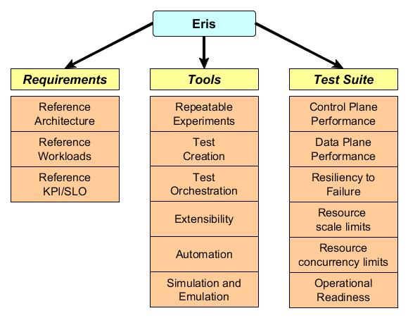
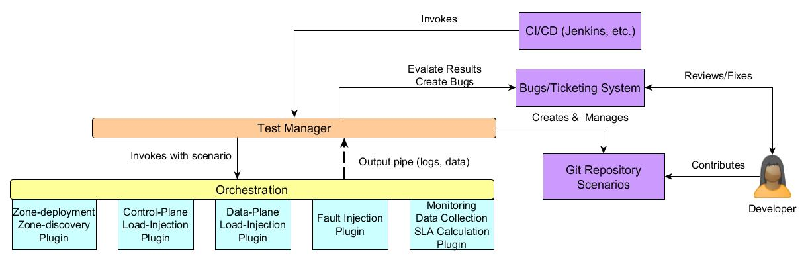
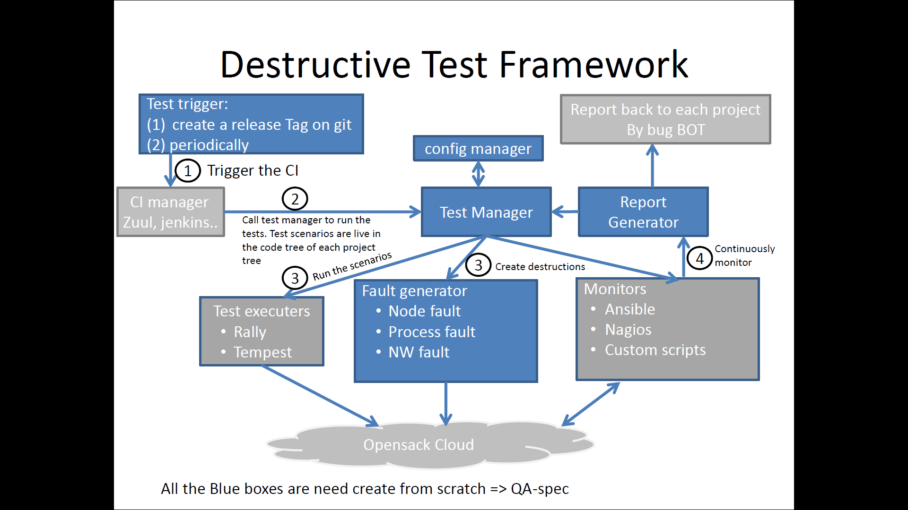
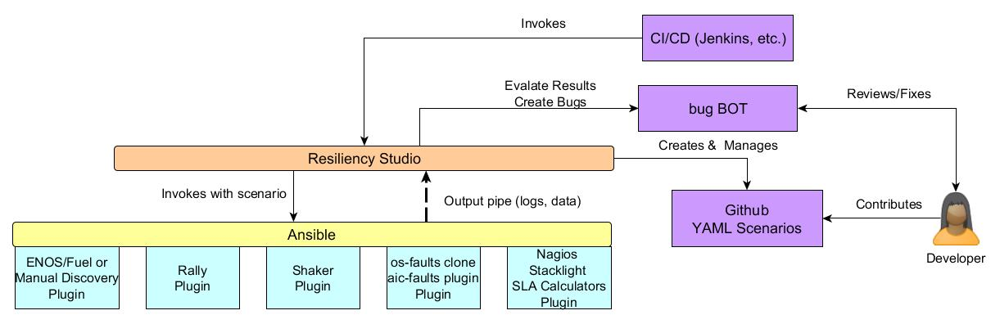

===============================================
 OpenStack Eris - an extreme testing framework
===============================================

.. contents::
   :depth: 2
   :local:

Introduction
============

OpenStack has been expanding at a breakneck pace. Its adoption has
been phenomenal and it is currently the go to choice for on premise
cloud IaaS software. From a software development perspective OpenStack
today has approximately *nLines* of code contributed by thousands
developers, reviewers and PTLs. There are new *mNewProjects* each year
and *kBlueprints* under review. Taking a look at its adoption
perspective, OpenStack clouds today power *nCPUs* cores of processors
in *nCompanys* companies. The installations handle a variety of
traffic anywhere from simple web hosting to extremely resource and SLA
intensive workloads like telecom virtual network functions (VNFs) and
scientific computing.

A commonly heard theme with regards to this rapid expansion in both,
installed footprint and the OpenStack software project, is resiliency
and performance. More specifically the questions asked are:

-  What are the resiliency and performance characteristics of OpenStack
   from a control and data plane perspective?

-  What sort of performance metrics can be achieved with a specific
   architecture?

-  How resilient is the architecture to failures?

-  How much resource scale can be achieved?

-  What level of concurrency can resource operations handle?

-  How operationally ready is a particular OpenStack installation?

-  How do new releases compare to the older ones with regards to the
   above questions?

OpenStack Eris is an extreme testing framework and test suite that
proposes to stress OpenStack in various different ways to address
performance and resiliency questions about OpenStack. Eris comes out
of `the LCOO working group <https://wiki.openstack.org/wiki/LCOO>`_'s
efforts to derive holistic performance, reliability and availability
characteristics for OpenStack installations at the release/QA
gates. In addition, Eris also aims to provide capabilities for third
party CI’s and other open source communities like OpenContrail,
etc. to execute and publish similar characteristics.

Goals and Benefits
==================

The major objective of the project has been outlined in the previous
section. To reiterate here: derive holistic performance, reliability and
availability characteristics for OpenStack. Figure 1 below translates
the breakup of this objective into specific goals to achieve that
objective. The aim of this section is to discuss in fairly abstract
terms these goals without diving into actual implementation details.

+-----------------------------+
| |image0|                    |
+=============================+
| **Figure 1: Goals of Eris** |
+-----------------------------+

Eris has three major goals that derive from its primary goal of deriving
holistic performance, reliability and availability characteristics of
OpenStack. Each of the major goals and their sub-goals are discussed in
detail below.

Goal 1: Requirements
--------------------

Define infrastructure architecture, realistic
workloads for that architecture and reference KPI/SLO valid for that
architecture.

- **Reference architecture(s):** Performance and resiliency
  characteristics of a system are valid for specific architectures
  they are configured for. Hence, one of our first goals is to define
  reference architectures on which tests will be run.

- **Reference workload(s):** When pursuing the assessment of
  performance and resiliency we should ensure that it is done under
  well-defined workloads. These workloads should be modeled on either
  normal or stressful situations that happen in real data
  centers. Unrealistic workloads skew results and provide data that is
  not useful.

- **Reference KPI/SLO(s):** The type of testing that Eris proposes is
  non-deterministic, i.e. performance or resiliency cannot be
  determined by the success or failure of a single transaction.
  Performance and resiliency are generally determined by using
  aggregates of certain metrics (e.g. percent success rate, mean
  transaction response times, mean time to recover, etc.) for a set of
  transactions run over an extended time period. These aggregate
  metrics are the Key Performance Indicators (KPIs) or Service Level
  Objectives (SLOs) of the test. These metrics need to be defined
  since they are will determine the pass/fail criteria for the
  testing.

Goal 2: Frameworks
------------------

Define the elements of an extreme testing framework that encompasses
the ability to create repeatable experiments, test creation, test
orchestration, extensibility, automation and capabilities for
simulation and emulation. The Eris framework is not tightly coupled to
the test suite or the requirements. This leaves it flexible for other
general purpose use like VNF testing as well.

- **Repeatable experiments:** For non-deterministic testing, the
  ability to create repeatable experiments is paramount. Such a
  capability allows parameters to be consistently verified within the
  KPI/SLO limits.

- **Test Creation:** Ease of test creation is a basic facility that
  should be provided by the framework. A test should be specified using
  an open specification and require minimal development (programming).
  It should maximize the capability for re-use between already
  developed components and test cases.

- **Test Orchestration:** Facilities for test orchestration should be
  provided by the framework. Test orchestration can span various layers
  of the reference architecture. The test orchestration mechanism
  should be able to orchestrate for the reference workloads and
  failures on the reference architecture and measure the reference
  KPI/SLO.

- **Extensibility:** The framework should be extensible at all layers.
  This means the plugin should be designed using a plugin/driver model
  with a significantly flexible specification to accomplish this goal.

- **Automation:** The entire test suite should be automated. This
  includes orchestrating various steps of the test along with computing
  a success/failure of the test based on the KPI/SLO supplied. This
  also explicitly means that good mathematics will be needed. There
  shouldn’t be eyeballing graphs to see if KPI are met or not met.

- **Simulation and Emulation:** Any framework that does performance and
  resiliency needs to have efficient and effective simulation and
  emulation mechanisms. These are especially useful to run experiments
  on constrained environments. Examples include – how would we know if
  OpenStack control plane components are ready for 5000 compute node
  scale? It is not possible to acquire that kind of hardware. So,
  testing will eventually need robust simulation and emulation
  components.

Goal 3: Test Suite
------------------

The test suite is the actual set of tests that are run by the
framework on the reference architecture with the reference workload
and faults specified. The end result is to derive the metrics related
to performance, reliability and availability.

- **Control Plane Performance:** This test suite will be responsible to
  run the reference API workload on various OpenStack components.

- **Data Plane Performance:** This test suite will be responsible to
  run the reference data plane workload. The expectation is that data
  and control plane performance workloads are run together to get a
  feel for realistic traffic in an install OpenStack environment.

- **Resiliency to Failure:** The test suites at either random or
  imperative points will inject failures into the system at various
  levels (hardware, network, etc.). The failure types could be simple
  or compounded failures. The KPI’s published will also include details
  on how OpenStack reacts and recovers from these failures.

- **Resource scale limits:** This test suite will seek to identify
  limits of resource scale. Examples are – how many VMs can be created,
  how many networks, how many cinder volumes, how many volumes per VM,
  etc.? The test suite will also track performance of various
  components as and how the resources are scaled. There isn’t an
  expectation of high concurrency for these tests. The primary goal
  being to flush out various “limits” as defined but not explicitly
  specified either by OpenStack or components it uses.

- **Resource concurrency limits:** This test suite will seek to
  identify limits of resource concurrency. Examples are – how many
  concurrent modifications can be made on a network, a subnet, a port,
  etc. As with resource scale limits, resources will need to be
  identified and concurrent transactions will need to be run against
  single resources. The test suite will track performance of various
  components during the test.

- **Operational readiness:** It is often times not feasible to run an
  entire gamut of long running tests as identified above. What is
  needed either for production readiness testing or for QA gates is a
  smoke test that signifies operational readiness. It is the minimal
  criteria needed to declare a code change good or a site healthy. The
  test suite will contain a “smoke test” for performance, reliability
  and availability labelled as its operational readiness test.

Review of Existing Projects
===========================

There has been a lot of work put in disparate projects, some successful
and some that aren’t that well known into building tools and creating
test suites for measuring OpenStack performance, reliability and
availability. This section will review these projects with our goals in
perspective and provide an analysis of the tools we intend to use.

Summary of Projects
-------------------

OpenStack/Rally
~~~~~~~~~~~~~~~

`Rally <https://docs.openstack.org/developer/rally/>`_ is currently
the choice for control plane performance testing. It has a flexible
architecture with a plugin mechanism that can be extended. It has a
wide base of existing plugins for OpenStack scenarios and this base
keeps on expanding. Most performance testing of OpenStack today uses
Rally. The benchmarks it provides today are mostly related to success
rate of the transactions and response times as it is only aware of
what is happening on the client side of the transaction. There is
scope for failure injection scenarios using an os-faults hook with
triggers.

OpenStack/Shaker
~~~~~~~~~~~~~~~~

`Shaker <https://opendev.org/performa/shaker>`_ is
currently the popular choice for data plane network performance
testing. It has a custom built image with agents and iperf/iperf3
toolsets along with a wide array of heat templates to instantiate a
topology. Shaker also provides various methods to measure metrics and
enforce SLA of the tests.

OpenStack/os-faults
~~~~~~~~~~~~~~~~~~~

The failure injection mechanism used within Rally and one that can
also be used independently is `os-faults
<https://opendev.org/performa/os-faults>`_. It consists of a CLI and
library. It currently contains failure injections that can be run at
either a hardware or a software level. Software failure injections are
network and process failures while hardware faults are via IPMI to
servers. Information about a site can be discovered via pre-defined
drivers (fuel, tcpcloud, etc.) or provided directly via a JSON
configuration file. The set of drivers can be extended by developers
for more automated discovery mechanisms.

Cisco/cloud99
~~~~~~~~~~~~~

`Cloud99 <https://github.com/cisco-oss-eng/Cloud99>`_ is Cisco open
source to probe high availability deployments of OpenStack. It
consists primarily of software the runs load on the control and data
plane, injects service disruptions and measures metrics. The load
runner for the control plane is a wrapper around OpenStack
Rally. There doesn’t seem to be a data plane load runner implemented
at this point in time. The metrics gathering is via Ansible/SSH and
the service disruptors use Paramiko/SSH to induce disruptions.

Other Efforts
~~~~~~~~~~~~~

There have been several other efforts that use some combination of the
tools mentioned above with custom frameworks to achieve in part some
of the objectives that have been set for Eris. Notable work includes:

- an Intel destructive scenario report using Rally and os-faults,

- `the Mirantis Stepler framework
  <https://github.com/Mirantis/stepler>`_ that uses os-faults for
  failure injection, and

- `the OSIC's ops-workload-framework
  <https://github.com/osic/ops-workload-framework>`_.

Most of this work focuses on control plane performance combined with
failure injection.

`The ENoS framework <https://github.com/BeyondTheClouds/enos>`_
combines Rally with a deployment of containerized OpenStack to
generate repeatable performance experiments.

Gap Analysis
------------

This section provides a gap analysis of the above tools with regards to
the goals of Eris. The purpose here is not to rule out or exclude the
tools from use in Eris. To the contrary, it is to identify the strengths
of the existing toolset and investigate where Eris needs to focus its
efforts.

Requirements Gaps
~~~~~~~~~~~~~~~~~

One of the major gaps identified above is the focus on frameworks at the
cost of a reference requirements. For any non-deterministic testing
mechanism that focuses on performance, reliability and availability the
underlying architecture, workloads and SLOs are extremely important.
Those are the references that give the numbers meaning. It is not that
the frameworks are secondary, but in the absence of the reference
requirements, numbers from frameworks and test suites are hard to
interpret and use. There are also specific gaps with framework and test
suites that are outlined below.

Framework Gaps
~~~~~~~~~~~~~~

**Repeatable Experiments:** *ENOS* is the only tool that is geared
towards generating repeatable performance experiments. However, it is
only valid for container deployments. There are various other deployment
tools like Fuel, Ansible, etc. but none that integrate deployment with
various test suites.

**Test Creation:** Rally is the de-facto in Control Plane performance
test specification. Most tools and efforts around performance and
failure injection of OpenStack have leveraged Rally – including Cloud99
and ENOS. Shaker is popular for network load generation and provides a
fairly good suite of out of the box templates for creating and
benchmarking various types of tenant network load. Although both tools
are extensible, there are major gaps with regards to specifying combined
control and data plane workloads – like a real IaaS would have. The gaps
include scenarios like I/O loads, network BGP loads, DPDK, CPU, memory
in the data plane. They include multi-scenario and distributed workload
generation in Rally. For failure injection specifications, Shaker
supports no failure injections. Rally supports single failure injections
via the os-faults library with the deterministic triggers (at specific
iteration points or times).

**Test Orchestration:** There are no tools today that support
distributed test orchestration. None of the tools analyzed above have
the ability to deploy a test suite to multiple
nodes/locations/containers, etc. and orchestrate and manage a test.
Further – integrating such capability into these tools would involve
some major re-architecture and refactoring [addRef-RallyRoadmap]. The
test orchestration SLA specifications today are fairly disparate for
control and data plane and they lack a uniform mechanism to add new
counters and metrics especially from Control Plane hosts or compute
hosts. Ansible seems to be used primarily as a crutch for SSH while
ignoring the many capabilities of Ansible that can actually solve the
various gaps.

**Extensibility:** Most tools surveyed are extensible for the simpler
changes – i.e. more failure injection scenarios, randomized triggers,
new API call scenarios, etc. However, the bigger changes seem to need
some fairly extensive changes. Examples includes various items in the
Rally roadmap that are blocked by a major refactoring effort. Shaker
also today doesn’t seem to have a failure injection mechanism plugged in
addition to not having other data plane load generation
tools/capabilities. They definitely do not support plugins to interface
with other third party (or proprietary) tools and make the integration
of different performance collection and computation counters difficult.

**Automation:** While there is a fair amount of thought paid today to
test setup and test orchestration automation, there is not a lot of work
in automating the success and failure criteria based on certain SLO.
Rally and Shaker both incorporate specific SLA verification mechanisms
but both are limited. Shaker is limited by what is observed on the guest
VMs and Rally by the API response times and success rates. The overall
health of an IaaS installation will require many more counters with more
complex mathematics needed to calculate metrics and verify the systems
capability to satisfy SLO.

**Simulation and Emulation:** Any major extreme testing framework is
never complete without competent simulators and emulators. There needs
to be the capability to test scale without actually having the scale. It
is especially important for an IaaS system. As an example take the case
of scaling an OpenStack cloud to 5000 compute nodes. Is it possible?
Probably not. However, to test software changes to make it possible
requesting 5000 actual computes is unrealistic. This is a major gap
today in OpenStack with no mechanisms to test scale or resiliency
without having “real” data centers. The only thing that comes close is
the RabbitMQ simulator in OpenStack/oslo.

Test Suite Gaps
~~~~~~~~~~~~~~~

**Control & Data Plane Performance:** Rally contains single scenarios
for performance testing which sample loads. Shaker contains various heat
templates for sample configurations. Neither can be classified as a test
suite where OpenStack runs and publishes performance related numbers.
Again, the limitation of not having multi-scenarios and distributed
workloads will come into play as performance numbers need to be run for
larger clouds. In such situations, workloads where only a single
machine/client is running orchestration may not be viable.

**Resiliency to Failure:** There are currently no test suites that
measure resiliency to failure. While an os-faults plugin exists in Rally
the library itself if out of maintenance today. There are no scenarios
of failures to the data plane. There has been an effort to identify
points of failure and types of failure along with executing failure
scenarios [AddRef-Intelos-faults]. However, these scenarios are run with
single rally workloads and its assertion that the traffic represents
real traffic seems unrealistic.

**Resource Scale & Concurrency Limits:** There are currently no test
suites that probe these limits. They are generally uncovered when
unsuspecting (or over enthusiastic) tenants try something complete way
out of what is “ordinary” and the operation fails. They typically end up
as bug reports and are investigated and fixed. What is needed is a
proactive mechanism to probe and uncover these limits.

**Operational Readiness:** There is currently no step in the OpenStack
QA workflow today that can take a reference architecture, reference
workload, reference KPI and run a battery of smoke tests that cover the
test suites mentioned in the points above. These smoke or “operational
readiness” tests are needed to ensure that fixes and changes to
components are not adversely impacting its performance, reliability and
availability. This does go back to fixing the gaps that such a test
would need at the QA gates, but once that gap if fixed such tests should
be a part of the workflow.

Eris Architecture
=================

Eris is architected to achieve the goals listed in Section 2. This
section specifies the basic components of Eris and the Eris QA workflow.
The idea is to get Eris down to an abstract framework that can be then
extended and implemented using a variety of tools. The QA workflow will
identify what points to run Eris.

Eris Framework
--------------

+------------------------------+
| |image1|                     |
+==============================+
| **Figure 2: Eris Framework** |
+------------------------------+

As depicted in Figure 2, the proposed Eris architecture is modular. The
dark blue boxes denote existing OpenStack systems that developers and
the community use. The CI/CD infrastructure will be responsible for
scheduling and invoking the testing. Tests that fail SLA/KPI criteria
will have bugs created for them in the ticketing system and the
community developers can create either tests targeted to their
components or tests that are cross-component.

**Test Manager:** The responsibility of the test manager is to invoke
test suite orchestration, interfacing with the bugs and ticketing
systems, storing logs and data for future reference. The underlying
orchestration layer and orchestration plugins all pipe data and logs
into the test manager.

**Orchestration:** The responsibility of the orchestration component is
to run a test scenario that can include deployment, discovery, load
injection, failure injection, monitoring, metrics collection and KPI
computation. The orchestration engine should be able to take an open
specification and turn it into concrete steps that execute the test
scenario. The orchestration engine itself may not be the tool that runs
all the scenarios.

**Zone Deployment:** The zone deployment plugin will take a reference
architecture specification and deploy an OpenStack installation that
complies with that reference architecture. It will also take various
reference workload and metrics collections specifications and deploy the
test tools in with the distribution specified. When the orchestrator
deploys an architecture based on a specification it will not need to
discover the zone.

**Zone Discovery:** In the event that the orchestration plugin operates
on an existing deployment it will need to discover the various
components of the reference architecture it is installed on. This will
be the responsibility of the zone discovery plugin. The zone discovery
plugin should also eventually be able to recognize a reference
architecture, although initially this capability may be complex to
incorporate.

**Control Plane Load Injection:** This plugin is responsible for setting
up and running the control plane load injection. The setup may include a
distributed multi-scenario load injection to mimic actual load into an
OpenStack IaaS installation depending on the reference workload. Running
load should be flexible enough to tune the load models across various
distributed nodes and specify ramp-up, ramp-down and sustenance models.
This plugin will run OpenStack API into the control plane services and
depending on the scenarios executed may need admin access to the zone.

**Data Plane Load Injection:** This plugin is responsible for setting up
various data plane load injection scenarios and running them. As with
the control plane load injection this can include a distributed
multi-scenario setup to mimic actual traffic depending on the reference
workload. While in the case of the control plane, the setup may include
something like creating a Rally deployment, in the data plane load
injection scenario it will be setting up tenant resources to run stress
on the data plane. Again, as with the control plane load injection, load
will need to be distributed across various nodes and be tunable to
ramp-up, ramp-down and sustenance models. Stress types should include
storage I/O, network, CPU and memory at a minimum.

**Failure Injection:** The failure injection plugin will be responsible
to inject failure into various parts of the reference architecture. The
failures could be simple failures or compound failures. The injection
interval can be either deterministic, i.e. based at a certain time or
workload iteration point, randomized or event driven, i.e. based on when
certain events are happening in the control or data plane. The nature of
the failure injection plugin demands that it have root access (or sudo
root) across every component in the reference architecture and tenant
space.

**Data Collection & KPI Computation:** Plugins for data collection and
SLA computation will collect various counters from API calls, tenant
space and the underlying reference architecture. Based on the matrix of
counters at various resource points and formulas supplied for KPI that
operate on this matrix, key process indicators (KPI) values are
computed. These KPI are then compared against the reference service
level objectives for the reference architecture and reference workload
combination to provide a pass/fail for the test. Hence, this plugin is
the final arbiter in whether the scenario passes or fails.

Eris Workflow
-------------

+--------------------------------+
| |image2|                       |
+================================+
| **Figure 3: Eris QA Workflow** |
+--------------------------------+

Apart from the actual Eris framework that is expected to execute the
tests, there is a component of Eris that needs to reside in the QA
framework. This actually has three major components identified.

**CI/CD Integration:** Eris test suites need to be integrated into the
CI/CD workflow. Test suite runs need to be tagged, the results archived
and bugs generated. Initially, there may be the capacity for all Eris
tests to be run. However, as and how the library of test suites and
reference architectures becomes more complex the gate QA will need to
rely on a smoke test/operational readiness test. Initially, the
identification of what constitutes a reasonable smoke test will have to
be done manually. However, there should be an evolution to automatically
identify a set of smoke tests that can be reasonably handled at the
CI/CD gates.

**Test Frequency:** The tests that Eris proposes to run are long running
tests. It may not be practical to run them at every code check-in. The
workflow proposal is for the smoke tests to be run one a day and an
operational readiness suite to be run one every week. This party CI’s
can rely on more exhaustive testing that can run into multiple days.

**Bug Reporting:** The reporting of bugs for Eris can be tricky. Bugs
are generated when analyzed KPI from the tests fail to meet defined
reference SLO’s. However, these bugs need to be reproducible. The
question becomes how many times should a test run before a KPI miss is
considered a bug? This is an open question that will consist of some
fairly hard mathematics to solve. It may depend on several states in the
system and reproducing specific conditions may not be possible every
time. A good approach to take is to create a bug but attach a frequency
tag to the bug. As and how KPI’s keep missing reference objectives a
frequency tag is incremented. The frequency tag can be attached to the
criticality of the bug and every 10 counts of a frequency tag can result
in the criticality of the bug being bumped up.

Eris Design
===========

This is the thinnest section by far in the document since not all the
parts of Eris have been thought about. It is good in a sense because it
provides a lot of opportunity for the community to fine tune the project
to its needs. There has been a fair amount of thought put forth on the
tools to be used and some of the enhancements that are needed. The main
focus of the design here will be to focus on a specification and
tools/libraries. The specification can then be broken up into specific
roadmap items for Queens and beyond. Keep in mind that the tools and
libraries will most certainly need changes that will extend their
current capabilities.

Design Components
-----------------

+--------------------------------------------------------+
| |image3|                                               |
+========================================================+
| **Figure 4: Eris Implementation Components (Partial)** |
+--------------------------------------------------------+

The general idea is to use Ansible to orchestrate the various test
scenarios. Ansible is python based and therefore will fit well into the
OpenStack community. It also has a variety of plugins already available
to orchestrate different scenarios. New plugins can be easily created
for specific scenarios that are needed for OpenStack Eris.

The use of Ansible will result in the following major benefits for the
project:

-  Decoupling of the orchestration (Ansible) and execution (Rally,
   Shaker, etc.).

-  Extensive use of existing Ansible plugins for installation and
   distributed orchestration of software.

-  Well documented and open source tool for extending and expanding the
   use of Eris.

-  Agentless execution since agents and tools require extra installation
   but rarely bring benefits for testing.

As can be seen from the proposed design above Eris does not exclude the
use of already existing tools for performance and failure injection
testing. In fact the use of Ansible as the orchestration mechanism
provides an incentive for re-using them.

The other benefit of using Ansible is the ability to include plug-ins
for third party proprietary tools with operators and companies
developing their own plugins that confirm to the Eris specification. As
an example, an operator may use HP Performance Center as a performance
testing tool, HP SiteScope for gathering metrics and IXIA for BGP load
generation. These could be private plugins for the operator to generate
specific load components and gather metrics while still using large
parts of Eris to discover, inject faults and compute KPI.

Deployment
----------

Roadmap Item – for the community to specify.

Discovery
---------

The discovery mechanism can use any tool to discover the environment. It
can be read from a file, use Fuel or Kubernetes, etc. However, in the
end the discovery mechanism should confirm to an Ansible dynamic
inventory that provides a structure that describes the site. The
description of the site can be expanded. However, the underlying load
injection mechanisms and metrics gathering mechanisms will depend on
this data. In short, the reference workload, failure injection and the
metrics gathering cannot see what the discovery cannot provide. So, if
initially the discovery provides only server and VM information those
are the only resources that can be probed.

Ideally, a site is composed of the following components:

-  Routers

-  Switches

-  Servers (Control & Compute)

-  Racks

-  VMs (or Containers)

-  Orchestration services (Kubernetes, Ceph, Calico, etc.)

-  OpenStack services and components (Rabbit, MariaDB, etc.)

   Eris will need all details related to these components – specifically
   ssh keys, IP addresses, MAC addresses and any other variables that
   describe how to induce failure and stress. It is not possible to
   provide an entire specification considering the variety of
   installations. However, an example will be provided with the Queens
   roadmap.

Load Injection
--------------

Control Plane
~~~~~~~~~~~~~

The tool for control plane load injection is Rally. Rally is very well
known in OpenStack and contains plenty of scenarios to stress the
control plane. Rally does have some gaps with distributed workload
generation and multi-scenario workloads. With respect to Eris, where the
idea is to loosely couple components that make up a scenario, tight
coupling with Rally is not desirable. Hence, Eris will use Rally single
scenarios. However, Eris will use its own functions and methods for
multi-scenario and distributed workload generation. Initially, Eris’
focus will be on multi-scenario execution with distributed load
generation closely following.

Data Plane
~~~~~~~~~~

The tool for data plane load injection is Shaker. Shaker already has a
custom image for iperf3 execution along with heat templates for
deployment. Eris’ goals for Shaker exceed that already defined with
Shaker and again there are some significant enhancements with Shaker
that will need to be accomplished. A couple of primary enhancements may
be the inclusion of various other data plane stress mechanisms and the
use of an agentless mechanism using ssh (which Ansible has extensive use
with) to control the load and gather metrics.

Fault Injection
---------------

TODO

Metrics Gathering
-----------------

TODO

SLA Computation
---------------

TODO

Eris Roadmap
============

TODO

Eris in Popular Literature
==========================

TODO

